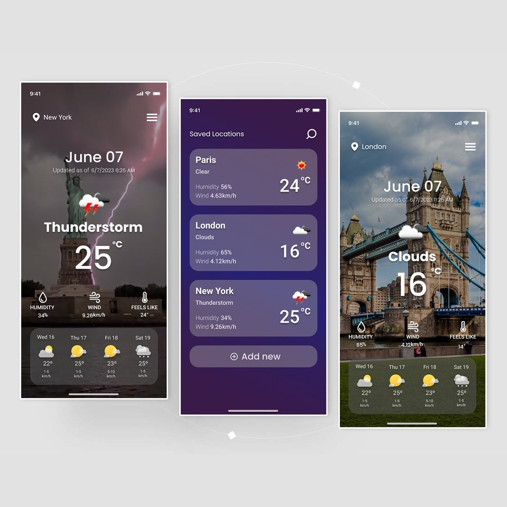

# HeyFlutter Coding Challenge - ui_challenge2

👨‍💻👩‍💻 We are thrilled to announce the next HeyFlutter "Coding Challenge", a fantastic opportunity to showcase your Flutter skills and compete to win some awesome rewards. In this Coding Challenge you will have to create these 3x screens of the "Weather App" in Flutter AND also the app should fetch real weather data using some Weather API to display it inside your Flutter app.
Make sure to submit this Flutter project until 27th November.

👉 Simply watch this video that explains this challenge in detail: 
https://youtu.be/5O1ZR0LaWfw?t=108

👉 To participate, simply fill out this Google Form here:  
https://forms.gle/M65Pzox5xFrc2DoJ7 

More details about this Coding Challenge below

Submission Deadline: November 27th, 2023
Objective: Develop a Flutter Weather App that fetches real weather data using an API
Rewards: Shoutout on Livestream, Sharing GitHub profile, Feedback for your project
Link to the UI design: https://www.figma.com/file/muEpuBiF0CM0yoLPm0wYRj/Weather-App-Design-Templates-(Community)?type=design&node-id=30-265&mode=design&t=PmmHV4tWLrcFJzCd-0 

    

